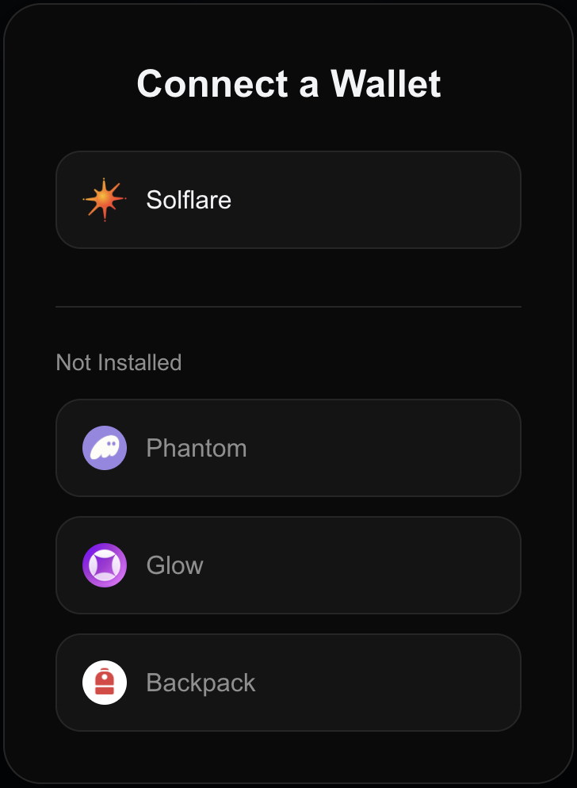

# Walletz - Solana Wallet Integration for Next.js

Walletz is a **high-quality, minimalistic, and fully customizable** React/Next.js package for integrating Solana wallets into your application with a simple **plug and play** **integration**.

* **[Demo](https://demo.walletz.fun)**
* **[Website](https://walletz.fun)**
* **[Twitter](https://x.com/walletzdotfun)**

---



---

## 🚀 Features

- 🔗 **One-line wallet connection** with `<WalletzButton />`
- 🏆 **Supports multiple wallets** (Phantom, Solflare, Glow, Backpack)
- 👾 **Supports wallet change detection**
- 🔄 **Auto-detects installed wallets**
- 🖥️ **Lightweight & customizable** (theme variables, styles, and components can be adjusted)
- 🛡️ **Secure wallet authentication & message signing**
- 🌐 **Fully compatible with Next.js & React apps**
- ⚡ **Customizable modal UI & theme options**

---

# 📌 Installation

```sh
npm install walletz
```

or

```sh
yarn add walletz
```

---

# 📖 Usage Guide

## 🔹 **Simple Integration (Next.js) - Plug and Play Setup**

This example demonstrates how easy it is to integrate Walletz into a **Next.js project** using the **client providers layout model**.

### **Step 1: Wrap Your App with `WalletzProvider`**

Create or modify your **`app/providers.tsx`**:

```tsx
"use client";

import React from "react";
import { WalletzProvider, WalletzConfig } from "walletz";

const LocalWalletzConfig: WalletzConfig = {
  rpcUrl: "https://solana.drpc.org/",
  autoConnect: true,
  theme: "dark" //or "light"
};

export default function Providers({ children }: { children: React.ReactNode }) {
  return (
    <WalletzProvider config={LocalWalletzConfig}>
      {children}
    </WalletzProvider>
  );
}
```

### Step 2: Wrap your `layout.tsx` in your `Providers`

Create or modify your **`app/layout.tsx`**:

```js
import React from "react";
import Providers from "./providers";

export default function RootLayout({
  children,
}: Readonly<{
  children: React.ReactNode;
}>) {
  return (
    <html lang="en">
        <body>
          <Providers>
            {children}
          </Providers>
        </body>
    </html>
  );
}

```

### **Step 3: Use `WalletzButton` and `WalletzModal` Anywhere in Your App**

Modify your **`app/page.tsx`**:

```tsx
import { WalletzButton, WalletzModal } from "walletz";

export default function Home() {
  return (
    <main>
      <h1>Welcome to My Solana dApp</h1>
      <WalletzButton />
      <WalletzModal />
    </main>
  );
}
```

**And that's it! 🎉** Your app now supports Solana wallets with automatic detection and a one-click connection button.

---

## 🔹 **Advanced Customization (Styling & Theming)**

Walletz provides full customization of its UI elements via **CSS variables**.

### **Customizing Themes**

To style Walletz, override the provided CSS variables in your own CSS file.

```css
.walletz-theme-light {
  --walletz-bg-primary: #ffffff;
  --walletz-bg-secondary: #f8fafc;
  --walletz-text-primary: #1e293b;
  --walletz-border-color: #e2e8f0;
  --walletz-button-gradient: linear-gradient(135deg, #3b82f6 0%, #2563eb 100%);
}

.walletz-theme-dark {
  --walletz-bg-primary: #0a0a0a;
  --walletz-bg-secondary: #141414;
  --walletz-text-primary: #f3f4f6;
  --walletz-border-color: #262626;
  --walletz-button-gradient: linear-gradient(135deg, #3b82f6 0%, #2563eb 100%);
}
```

**To enable theme switching dynamically,** simply update `theme` in your `LocalWalletzConfig` with `light` or `dark`

### **Button Customization**

You can override the default button styles by adding CSS:

```css
.walletz-connect-button {
  background: var(--walletz-button-gradient);
  color: white;
  font-weight: bold;
  padding: 10px 18px;
  border-radius: 14px;
  cursor: pointer;
}
.walletz-connect-button:hover {
  background: var(--walletz-button-hover);
}
```

**Example:** Using a custom-styled button

```tsx
<WalletzButton className="my-custom-button" />
```

---

## 🔹 **Available Functions & API**

The `useWalletz()` hook provides the following functions:

```tsx
const {
  connect,
  disconnect,
  signMessage,
  getBalance,
  getTokenBalances,
  openModal,
  closeModal,
  isModalOpen,
} = useWalletz();
```

| Function                                          | Description                               |
| ------------------------------------------------- | ----------------------------------------- |
| `connect(walletName: string): Promise<void>`    | Connect to a specific wallet type         |
| `disconnect(): Promise<void>`                   | Disconnect the currently connected wallet |
| `signMessage(msg: string): Promise<Uint8Array>` | Sign a message using the connected wallet |
| `getBalance(): Promise<number>`                 | Fetches the user's SOL balance            |
| `getTokenBalances(): Promise<TokenBalance[]>`   | Fetches the user's SPL token balances     |
| `openModal(): void`                             | Opens the wallet selection modal          |
| `closeModal(): void`                            | Closes the wallet selection modal         |
| `isModalOpen: boolean`                          | Indicates whether the modal is open       |

### **Example: Fetching Balance & Signing Messages**

```tsx
import { useWalletz } from "walletz";

export default function WalletActions() {
  const { getBalance, signMessage } = useWalletz();

  async function checkBalance() {
    const balance = await getBalance();
    console.log(`SOL Balance: ${balance}`);
  }

  async function sign() {
    const message = "Hello, Solana!";
    const signature = await signMessage(message);
    console.log(`Signed Message:`, signature);
  }

  return (
    <div>
      <button onClick={checkBalance}>Check Balance</button>
      <button onClick={sign}>Sign a Message</button>
    </div>
  );
}
```

---

# 🌟 Conclusion

Walletz provides a **simple, powerful, and customizable** way to integrate Solana wallets into your Next.js app. Whether you need a **one-line wallet connection** or **deep customization options**, Walletz is the perfect solution.

---

### 🎯 **Next Steps**

- ✅ **Try it out**: Install and integrate Walletz in your app.
- 🎨 **Customize UI**: Modify the theme, buttons, and styles.
- 🚀 **Go live**: Deploy your app with seamless Solana wallet integration!

For more updates and improvements, stay tuned! 🚀
